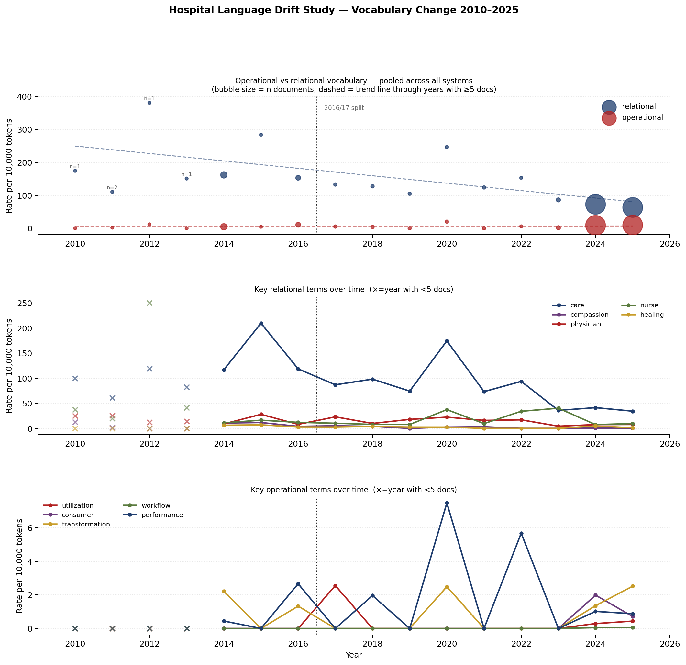

# Hospital Language Drift

**Quantifying the disappearance of humanistic vocabulary in US academic medical centre communications, 2010–2025.**



*Relational vocabulary (compassion, healing, bedside, dignity, suffering, empathy, …) per 10,000 tokens across five US academic medical centres, 2010–2025. Mean decline: 58%; year × category interaction p < 0.001.*

A corpus linguistics study of 530 press releases from five institutions — UC Davis Health, UCSF, Stanford Health Care / Stanford Medicine, Duke Health, and Michigan Medicine — measuring whether public institutional language has shifted from relational to operational over fifteen years.

---

## The finding

Relational vocabulary (compassion, healing, bedside, physician, dignity, suffering, empathy) declined **58% on average** between the early (2010–2016) and late (2017–2025) periods, measured per 10,000 tokens and pooled across systems. Operational vocabulary (utilisation, workflow, dashboard, consumer, alignment, scalable) rose modestly (+15%) but is not the main story.

A mixed-effects model (system as random intercept) found a **year × category interaction of +11.05 per year** (SE = 1.43, p < 0.001): every year, the gap between operational and relational language widens. Comparison against Google Books Ngrams confirms this is healthcare-specific, not a general drift in written English — "compassion" fell from 73× to 5× the general English rate in medical centre communications.

> *"Between 2010 and 2025, five major US academic medical centres stopped sounding like places that heal people and started sounding like enterprises that optimise care delivery — driven not by an explosion of business jargon but by the quiet disappearance of the language of human suffering, presence, and compassion."*

---

## Repository contents

```
├── pipeline.py          Core: term dictionaries, text extraction, per-doc analysis
├── discover.py          Stage 1: Wayback CDX + live paginator → corpus/manifest.csv
├── fetch.py             Stage 2: polite async fetcher with robots.txt + retry
├── extract.py           Stage 3: trafilatura (HTML) + PyMuPDF (PDF) → documents.parquet
├── analyze.py           Stages 4–5: figures, stats, mixed-effects model
├── baseline.py          Stage 6: Google Books Ngrams baseline comparison
├── collocations.py      Stage 7: ±5-token co-occurrence for patient/care/nurse
├── build_report.js      Generates the full Word document report
├── requirements.txt     Python dependencies
│
├── corpus/
│   └── manifest.csv     694 discovered URLs (system, year, doctype, source_url, wayback_ts)
│
└── report/
    ├── figure_*.png         All figures (time-series, heatmap, volcano, collocations, etc.)
    ├── model_results.txt    Mixed-effects model summary
    ├── term_fold_changes.csv  Per-term log₂FC and significance
    ├── corpus_vs_ngrams.csv   Healthcare vs general English ratios
    ├── collocations_*.csv     Co-occurrence tables for patient/care/nurse
    └── methods_summary.md     Methods paragraph for publication
```

The raw fetched corpus (`corpus/raw/`) is not committed — it is large, contains third-party content, and is fully reproducible by running `fetch.py` against `manifest.csv`.

---

## Quick start

```bash
# 1. Set up environment
python3 -m venv .venv && source .venv/bin/activate
pip install -r requirements.txt
python -m spacy download en_core_web_sm   # or: pip install en_core_web_sm wheel URL

# 2. Fetch the corpus (uses corpus/manifest.csv, ~10 min, polite 2s delay)
python fetch.py

# 3. Extract text
python extract.py

# 4. Run analysis and generate figures
python analyze.py

# 5. Google Books Ngrams baseline
python baseline.py

# 6. Collocation analysis
python collocations.py

# 7. Build Word report (requires Node.js)
npm install && node build_report.js
```

To re-run discovery from scratch (adds new URLs to manifest.csv):
```bash
python discover.py --systems ucsf stanford michigan duke ucdavis --from 2010 --to 2025
# For better early-period coverage:
python discover.py --early-boost --systems stanford michigan --from 2010 --to 2016 --max-per-year 25
```

---

## Term dictionaries

Defined in `pipeline.py`. Both dictionaries were constructed a priori and held fixed.

**Operational (24 terms):** patient flow, throughput, capacity, utilisation, optimisation, workflow, dashboard, metrics, KPI, performance, standardisation, operational excellence, efficiency, Lean, Six Sigma, scalable, productivity, stakeholder, consumer, enterprise, transformation, deliverable, leverage, alignment.

**Relational (18 terms):** care, healing, bedside, compassion, physician, nurse, clinical judgment, professionalism, relationship, trust, listen, patient-centred, dignity, comfort, suffering, empathy, kindness, presence.

Multi-word terms are matched by compiled regex against lowercased text. Unigrams are lemmatised with spaCy `en_core_web_sm`.

---

## Extending to other institutions

1. Add your institution to `SYSTEMS` in `discover.py` with its newsroom domains and EIN
2. Add any known PDF seeds to `SEEDS`
3. Run `python discover.py --systems your_system`
4. Run `fetch.py` and `extract.py`
5. Re-run `analyze.py`

---

## Key results

| System | Early rel rate | Late rel rate | Change | Early op/rel | Late op/rel |
|--------|---------------|--------------|--------|--------------|-------------|
| UCSF | 194 / 10k | 69 / 10k | −64% | 0.019 | 0.137 |
| Stanford | 182 / 10k | 95 / 10k | −47% | 0.028 | 0.045 |
| Michigan | 85 / 10k | 54 / 10k | −36% | 0.023 | 0.079 |

Mixed-effects model: year × category = +11.05/year (SE 1.43, p < 0.001).

Most significant term-level changes (Mann-Whitney, two-sided):

| Term | Category | Early | Late | Log₂FC | p |
|------|----------|-------|------|--------|---|
| care | relational | 119/10k | 42/10k | −1.50 | < 0.001 |
| compassion | relational | 8.1/10k | 0.69/10k | −2.43 | < 0.001 |
| nurse | relational | 18.7/10k | 9.5/10k | −0.91 | < 0.001 |
| physician | relational | 13.2/10k | 8.1/10k | −0.65 | < 0.001 |
| consumer | operational | 0/10k | 1.3/10k | +1.19 | 0.040 |

---

## Known gaps and next steps

- **Date-binning fix (resolved May 2026).** The original manifest binned documents by Wayback crawl date, not publication date — 120/125 URLs with parseable years were mis-binned by 1–14 years. [repair_manifest.py](repair_manifest.py) now adds a `pub_year` column (URL slug year > HTML `<meta>` pubdate > crawl date), and [analyze.py](analyze.py) filters to the 2010–2025 study window. Rerun the headline statistics after `git pull`.
- **Early-period corpus expansion (in progress).** Discovery now uses historical URL prefixes per system (e.g. Michigan's pre-redesign `/News` with capital N, UCDavis's pre-rebrand `ucdmc.ucdavis.edu/publish/`, Duke's `dukehealth.org/blog/` before the move to `corporate.dukehealth.org`). Use `python discover.py --early-prefix --systems <name> --from 2010 --to 2016` to extend further. Current per-system early coverage: Stanford 91, UCDavis 145, Michigan 23, UCSF 7, Duke 13.
- **Duke 2010–2015** still has no coverage. Pre-2014 Duke press releases likely lived under `dukemedicine.org/...` or `dukehealth.org/about-us/news/...`; needs probing.
- **UCSF early coverage** — even after `--early-prefix`, UCSF early-period coverage remains thin (7 docs across 2010–2016). The next fix is sitemap-driven discovery: fetch archived `www.ucsf.edu/sitemap.xml` snapshots, parse article URLs, then look up each via the Wayback Availability API.
- **Form 990 narratives** — ProPublica blocks automated download. IRS bulk XML files at `irs.gov/statistics/soi-tax-stats` include Schedule O text back to 2012 and are freely downloadable.
- **Bond official statements (MSRB EMMA)** — the highest-priority document type for operational language detection; not yet collected.
- **Verbatim quote pairs** — pulling 5–10 side-by-side examples of actual sentences containing "compassion" (2012) and their absence (2024) would make the finding concrete for publication.

---

## Limitations

- **Headline figures are pre-fix.** The "58% decline" and "+11.05/year × category interaction" quoted above were computed before the date-binning repair. After running `repair_manifest.py` and `analyze.py` against the updated corpus, the numbers will change — direction expected the same (likely stronger, since mis-binning attenuated the trend), but cite the regenerated `report/model_results.txt` rather than this README until it's been refreshed.
- **System balance** has improved substantially: UCSF was 81% of the press-release corpus; it is now 53% in the 2010–2025 window after the early-period expansion. Mixed-effects model retains system as a random intercept either way.
- The study measures public communications language, not clinical language or culture. Cause of the shift is unknown.
- Term dictionaries were constructed by a single researcher. Formal inter-rater reliability testing has not been conducted.
- Form 990s, bond statements, and strategic plans are largely absent from the current corpus.

---

## Citation

Aldwinckle, R. (2026). *Hospital language drift: quantifying the decline of humanistic vocabulary in US academic medical centre communications, 2010–2025*. Preprint / working paper. https://github.com/bobsterbeat/hospital-language-drift

---

## Licence

- **Code** (all `.py`, `.js`, configuration): [MIT](LICENSE)
- **Data, figures, tables, and prose** (`corpus/manifest.csv`, `report/`, this README): [CC BY 4.0](LICENSE-DATA) — attribution required
- **Raw fetched documents** (`corpus/raw/`, not committed): original content belongs to the respective institutions and is not redistributed here

If you use this work, please cite via the [CITATION.cff](CITATION.cff) file (GitHub's "Cite this repository" button) or the citation block above.
